# Hi there 👋, I'm Aman Pratap Singh

---

## 🌟 About Me

<table>
<tr>
<td width="50%">

### 🎓 Education
**B.Tech Computer Science** student at **JK Lakshmipat University**

### 💡 Interests
- Full-Stack Development
- AI/ML & Deep Learning
- Embedded Systems
- Design Thinking

### 🧠 Currently Learning
- React & Advanced JavaScript
- STM32 Microcontrollers
- Deepfake Detection
- SBERT & NLP
- RVM & OpenCV

</td>
<td width="50%">

### 🚀 Goal
To become a **Full-Stack Developer** and build my own **tech startup**

### 🔥 Passionate About
- Building innovative solutions
- Open source contribution
- Hardware-software integration
- Creating user-centric designs

### 🎯 Focus Areas
- **Frontend**: React, Modern CSS, UI/UX
- **Backend**: Node.js, Python, APIs
- **AI/ML**: Computer Vision, NLP
- **Hardware**: STM32, Arduino, IoT

</td>
</tr>
</table>

---

## 🏆 Recent Hackathons & Achievements

| 🏅 Event | 🚀 Project | 🛠️ Tech Stack |
|----------|------------|---------------|
| **IYD Hackathon 2025** | AI-based Ramayana Fact Checker | SBERT, NLP, Python |
| **Frontend UI Hackathon 2025** | Dashboards, Games & Animated Pages | HTML5, CSS3, JavaScript |
| **Circuit Jam by IIIT Surat** | Temperature Monitoring System | STM32, EasyEDA |
| **College Projects** | RTI Portal, PhotoEdit Pro, Aarambha 2025 | React, Node.js, Full-Stack |

---

## 💻 Tech Stack & Tools

### 💡 Programming Languages

### ⚙️ Frameworks & Libraries

### 🔬 AI/ML & Data Science

### 🔌 Hardware & Embedded

### 🎨 Design & Tools

---

## 🚀 Featured Projects

### 🌿 Virtual Herbal Garden
> 3D simulation of plant care with AI chatbot & gamified interface for herbal education
> 
> **Tech Stack:** HTML, CSS, JavaScript, Blender, AI
> 
> **Status:** ✅ Completed

### 📺 Deepfake Detector
> AI-based website to detect face-swapped deepfake videos using advanced ML models
> 
> **Tech Stack:** RVM, OpenCV, Flask, React
> 
> **Status:** 🚧 In Progress

### 🧠 Ramayana Fact Checker
> Validates facts using SBERT & English-translated verses of Ramayana
> 
> **Tech Stack:** SBERT, CSV, Python
> 
> **Status:** ✅ Completed

### 🌡️ STM32 Temperature Monitor
> Reads analog temperature from TMP36 sensor & displays on LCD
> 
> **Tech Stack:** STM32CubeIDE, EasyEDA
> 
> **Status:** ✅ Completed

### 👾 Retro Platformer Game
> Pixel-art-based browser game made for a hackathon
> 
> **Tech Stack:** HTML, CSS, JavaScript
> 
> **Status:** ✅ Completed

### 🎨 Cyberpunk AR Filter
> Interactive AR experience with face/body tracking & SFX
> 
> **Tech Stack:** Snap Lens Studio
> 
> **Status:** ✅ Completed

### 🏫 RTI Education Portal
> Comprehensive education portal with multi-age frontend interfaces and adaptive learning paths
> 
> **Tech Stack:** React, Node.js, MongoDB, Bootstrap
> 
> **Status:** ✅ Completed

### 📸 PhotoEdit Pro
> Advanced photo editing web application with filters, cropping, and AI-powered enhancements
> 
> **Tech Stack:** JavaScript, Canvas API, CSS3, WebGL
> 
> **Status:** ✅ Completed

### 🎓 Aarambha 2025 Website
> Official college event website with dynamic content, registration system, and interactive features
> 
> **Tech Stack:** HTML5, CSS3, JavaScript, PHP, MySQL
> 
> **Status:** ✅ Completed

---

## 📊 GitHub Statistics

---

## 🌟 Professional Journey

```mermaid
graph LR
    A[🎓 B.Tech CSE Student] --> B[💻 Learning Full-Stack]
    B --> C[🤖 AI/ML Explorer]
    C --> D[🔌 Embedded Systems]
    D --> E[🚀 Future Tech Entrepreneur]
    
    style A fill:#58a6ff
    style B fill:#1f6feb
    style C fill:#8b5cf6
    style D fill:#fb8500
    style E fill:#238636
```

---

## 🎯 Current Focus Areas

| 🔥 Area | 📚 Learning | 🎯 Goal |
|---------|-------------|---------|
| **Frontend Development** | React, Advanced CSS, UI/UX | Build responsive, interactive web apps |
| **Backend Development** | Node.js, APIs, Databases | Create scalable server-side solutions |
| **AI/ML** | SBERT, Computer Vision, NLP | Develop intelligent applications |
| **Embedded Systems** | STM32, IoT, Hardware Integration | Bridge software and hardware |

---

## 🌈 Fun Facts About Me

🎮 **Gaming Enthusiast** - Love retro games and building my own  
🎨 **Design Thinking** - Passionate about creating user-centric designs  
🤖 **AI Explorer** - Always experimenting with new ML models  
🔧 **Hardware Hacker** - Enjoy building IoT projects and embedded systems  
📚 **Continuous Learner** - Always learning new technologies and frameworks  

---

## 🤝 Let's Connect!

---

### 💫 "Building the future with code ⚡"
### 🤖 "AI enthusiast & problem solver"
### 🚀 "Full-stack developer in making"
### ✨ "Hardware + Software = Magic"

---

---

**⭐ If you find my work interesting, please consider giving a star to my repositories!**
